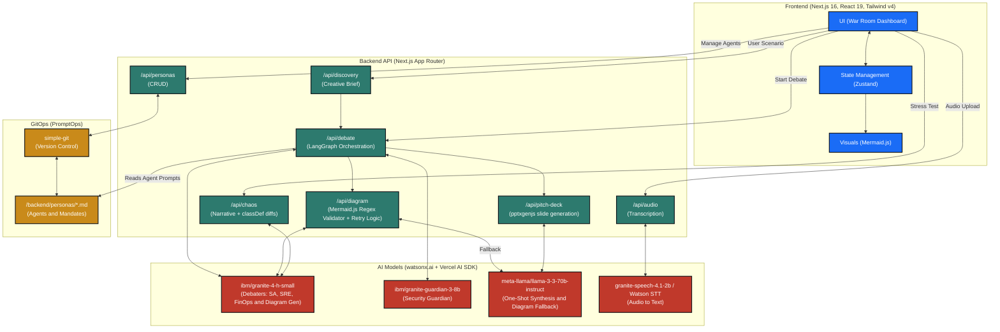

# 🏗️ The AI Enterprise Architect

> **Built for the IBM AI Builders Challenge**  
> Transforming enterprise IT architecture from a manual bottleneck into an AI-augmented creative process.

The AI Enterprise Architect is a multimodal AI creative partner that bridges the gap between business imagination and technical execution. Instead of acting as a simple code generator, this platform simulates a real-world Architecture Review Board. It orchestrates a debate among specialized AI personas to design, stress-test, and document enterprise-grade infrastructure.

---

## 🔍 Problem Statement

Enterprise IT architecture decisions are high-stakes, slow, and siloed. Today's process looks like this:

1. **Manual bottleneck** — A single Solutions Architect drafts an infrastructure design, then circulates it for weeks through email threads and meeting chains to collect feedback from SRE, FinOps, and Security teams.
2. **Cognitive overload** — No individual can hold cost efficiency, reliability SLOs, compliance mandates, and security best practices in their head simultaneously. Critical trade-offs get missed until production.
3. **Lost institutional knowledge** — Architecture decisions, the reasoning behind them, and the objections that shaped them are buried in meeting recordings and Slack threads. New team members inherit systems they can't explain.
4. **Presentation gap** — Technical architects struggle to translate infrastructure decisions into executive-friendly deliverables. The C-Suite gets either a wall of YAML or a slide deck that hides the real risks.

The result: enterprise architecture reviews take weeks, produce inconsistent outputs, and leave compliance gaps that surface only during audits or outages.

## 💡 Solution Description

The AI Enterprise Architect compresses a multi-week Architecture Review Board into a single interactive session:

* **Describe, don't prescribe.** The user provides a plain-English business scenario (e.g., *"I need a real-time fraud detection pipeline processing 50K events/sec"*). The platform's Discovery step translates this into a structured creative brief — no YAML, no Terraform, no prior cloud expertise required.
* **Debate, don't dictate.** Four specialized AI personas (Solutions Architect, SRE, FinOps, Security) engage in a bounded, concurrent 3-round debate. Each persona critiques the design from its domain perspective, raising explicit objections or giving an explicit "no objection" — mirroring how a real review board operates.
* **Synthesize into deliverables.** Once the debate converges, a one-shot synthesis step produces: (a) a validated **Mermaid.js architecture diagram**, and (b) a downloadable **Executive Pitch Deck** (`.pptx`) — bridging the presentation gap between engineering and the C-Suite.
* **Iterate with voice.** Upload a meeting recording (`.mp3`). A Scrum Master agent extracts architectural critiques from the audio and autonomously patches the Mermaid diagram to reflect human feedback — closing the loop between the AI board and the real one.
* **Stress-test with chaos.** Simulate failure scenarios (e.g., *"Black Friday Traffic"*). The Chaos Engineering Storyteller narrates a multi-beat failure and recovery sequence while recoloring diagram nodes in real-time.

## 🧠 AI Approach & Architecture

The architecture relies on a robust tech stack that orchestrates multiple AI models using LangGraph, integrates seamlessly with Next.js, and enforces AI governance via GitOps.



### Multi-Agent Orchestration (LangGraph)

The debate engine is a **LangGraph `StateGraph`** — not a simple chain of prompts. The graph is built dynamically at runtime from persona files: adding or removing a Markdown file under `backend/personas/agents/` changes the graph without touching `graph.ts`.

**Debate Flow:** `Discovery` → `[Round 1: SA → SRE → FinOps → Security (concurrent)]` → `[Round 2: …]` → `[Round 3: …]` → `Synthesis` → `Diagram + Deck`

* **Bounded loop:** Fixed at 3 rounds max, then forced synthesis. The graph is never unbounded.
* **Concurrent execution:** Per-round agent calls run via `Promise.all`, so adding personas does not linearly increase wall-clock latency.
* **Structured turn protocol:** Each agent turn ends with either an objection + reason, or an explicit "no objection." This structured output makes the debate inspectable and resumable.

### IBM Granite Model Routing

| Purpose | Model | Notes |
|---------|-------|-------|
| Debater personas (SA, SRE, FinOps) | `ibm/granite-4-h-small` | Per-turn, inside the debate loop |
| Diagram generation | `ibm/granite-4-h-small` | Uses regex-based server-side validation & retry |
| Guardian persona (Security) | `ibm/granite-guardian-3-8b` | Thinking mode, BYOC compliance criteria |
| One-shot synthesis & Diagram Fallback | `meta-llama/llama-3-3-70b-instruct` | Called once after the debate; fallback on diagram parse failure |
| Audio transcription (primary) | `granite-speech-4.1-2b` | Multipart audio upload |
| Audio transcription (fallback) | Watson Speech-to-Text | Activated via `STT_PROVIDER=watson` env var |

### GitOps for AI (PromptOps)

Agent personas, compliance mandates, and guardrails are **version-controlled Markdown files** — not hardcoded prompts. Every edit is a real `git commit` via `simple-git`. Enterprise teams govern AI behavior through standard Pull Requests: edits take effect on the next request without a redeploy.

### Guardrails

* The **Security guardian** (`granite-guardian-3-8b`) runs in thinking mode with `reasoningEffort: high` and evaluates designs against Bring-Your-Own-Criteria (BYOC) compliance mandates stored in `backend/personas/compliance/` (IAM rules, data residency rules).
* Mermaid diagram output is validated server-side with `mermaid.parse()` before rendering — malformed LLM output triggers a retry, never a blank screen.
* Persona files with malformed frontmatter are skipped gracefully; the debate continues with valid personas.

## 🎯 Selected Challenge Theme

**July Challenge - Reimagine Creative Industries** — AI only

## 🤖 How IBM Bob Was Used

[IBM Bob](https://github.com/ibm/bob) was used as the **skill and workflow framework** that guided the AI development process throughout this project. Four custom Bob skills were created under `.bob/skills/` to encode the project's architectural constraints and repeatable workflows:

| Bob Skill | Purpose |
|-----------|---------|
| `war-room-debate-skill.md` | Encodes the LangGraph debate loop protocol — bounded 3 rounds, concurrent per-round execution, structured objection output |
| `gitops-persona-skill.md` | Defines the GitOps workflow for persona files — YAML frontmatter schema, `simple-git` commit discipline, runtime loader behavior |
| `mermaid-chaos-skill.md` | Documents the Chaos Engineering Storyteller workflow — multi-beat narrative generation and `classDef` diff-based diagram recoloring |
| `pptx-narrative-skill.md` | Specifies the Executive Pitch Deck generation workflow — 5-slide structure via `pptxgenjs`, content mapping from synthesis output |

Additionally, a **custom Bob mode** (`enterprise-architecture-builder`) was defined in `.bob/custom_modes.yaml` to enforce project-wide constraints during development:
- All multi-agent coordination must use LangGraph state machines (never plain chained calls).
- Model routing discipline — the correct Granite model for each purpose (debater, guardian, synthesis).
- Mandatory validation gates — `mermaid.parse()` before diagram completion, slide count verification for `.pptx` exports, and 3-round termination checks.
- Documented fallback paths for every external service call (watsonx, Watson STT, Granite Speech).

Bob skills served as the **single source of truth** for how each major feature should be implemented, ensuring consistency across the codebase and preventing architectural drift as the project evolved.

## ✨ Core Features

* **GitOps for AI (PromptOps):** AI guardrails, agent personas (SA, SRE, FinOps, Security), and compliance mandates are stored as version-controlled Markdown files under `backend/personas/`. Enterprise teams govern AI behavior via standard Pull Requests — edits take effect on the next request without a redeploy.
* **The Multi-Agent War Room:** Powered by IBM Granite models via watsonx, specialized AI agents debate architectural trade-offs (speed vs. cost vs. reliability) in a bounded 3-round LangGraph loop. Per-round agent calls run concurrently; adding a persona does not increase wall-clock latency.
* **Technical Storytelling:** The platform automatically translates the agreed-upon architecture into two deliverables:
  * A dynamically rendered **Mermaid.js** visual diagram. It uses `ibm/granite-4-h-small` (via Vercel AI SDK and watsonx) for generation with a fallback to `meta-llama/llama-3-3-70b-instruct`. The output is validated with a structural regex check server-side, then rendered client-only to avoid Node.js DOM issues.
  * A downloadable **Executive Pitch Deck** (`.pptx`) generated with `pptxgenjs`, tailored for the C-Suite.
* **Audio Feedback Loop (The Review Board):** Upload a meeting recording (`.mp3`). A Scrum Master agent extracts architectural critiques and autonomously patches the Mermaid diagram to reflect human feedback. Uses `granite-speech-4.1-2b` as primary STT, Watson Speech-to-Text as fallback (controlled by `STT_PROVIDER` env var).
* **Chaos Engineering Storyteller:** Simulate stress tests (e.g., "Black Friday Traffic"). The AI generates a multi-beat narrative (normal → strain → failure → failover → recovery) while updating Mermaid `classDef` diffs in real-time to recolor nodes — never a full re-render.

## 🤖 Agent Personas

Four specialized debater personas and one guardian persona, each defined as a Markdown file under `backend/personas/agents/`:

| Agent | Role | Model |
|-------|------|-------|
| **Solutions Architect (SA)** | Proposes and iteratively refines the architecture | `ibm/granite-4-h-small` |
| **SRE** | Critiques for reliability, latency, and SLO risk | `ibm/granite-4-h-small` |
| **FinOps** | Critiques for cost efficiency and TCO | `ibm/granite-4-h-small` |
| **Security** | Evaluates against BYOC compliance mandates (IAM, data residency) | `ibm/granite-guardian-3-8b` |

Synthesis is performed exactly once per session by `meta-llama/llama-3-3-70b-instruct` — never in the debate loop.

> **Region note:** `ibm/granite-4-h-small` is verified in **us-south**. The fallback model for `ca-tor` is `meta-llama/llama-3-3-70b-instruct`. Set `WATSONX_AI_REGION=us-south` in your `.env.local` for full Granite support.

## 🛠️ Tech Stack

* **LLM Engine:** IBM Granite (`granite-4-h-small`, `granite-guardian-3-8b`) and Llama (`llama-3-3-70b-instruct`) via `watsonx-ai-provider`
* **AI SDK:** Vercel AI SDK (`ai` package) — `generateText` / `streamText`
* **Orchestration:** LangGraph (`@langchain/langgraph`) — bounded 3-round `StateGraph` built dynamically from persona files
* **Frontend:** Next.js 16 (App Router), React 19, Tailwind CSS v4
* **State Management:** Zustand
* **Visuals & Deliverables:** Mermaid.js v11 (validated SVGs), `pptxgenjs` v4 (PowerPoint generation)
* **GitOps:** `simple-git` — every persona edit is a real git commit, never a silent overwrite
* **Markdown Parsing:** Custom YAML frontmatter parser (no external dependency — handles the controlled schema used by persona files)

## 📂 Project Structure

```text
/ai-enterprise-architect
├── backend/
│   ├── personas/
│   │   ├── agents/              # GitOps agent persona files (Markdown + YAML frontmatter)
│   │   │   ├── sa.md            # Solutions Architect — proposes the initial design
│   │   │   ├── sre.md           # Site Reliability Engineer — reliability / SLO critiques
│   │   │   ├── finops.md        # FinOps — cost efficiency and TCO critiques
│   │   │   └── security.md      # Security guardian — BYOC compliance evaluation
│   │   └── compliance/          # Compliance mandate files loaded by the Security agent
│   │       ├── iam.md           # IAM rules (least-privilege, MFA, session expiry)
│   │       └── data-residency.md # Data residency rules (PII region, cross-border logging)
│   ├── lib/
│   │   ├── debate/              # LangGraph debate engine
│   │   │   ├── state.ts         # DebateState type
│   │   │   ├── graph.ts         # StateGraph — dynamic node wiring from persona loader
│   │   │   ├── load-personas.ts # Runtime persona loader (max 6 debaters, turn_order sort)
│   │   │   ├── synthesis.ts     # One-shot synthesis via meta-llama/llama-3-3-70b-instruct
│   │   │   └── agents/          # Individual agent node implementations
│   │   ├── mermaid/
│   │   │   ├── generate.ts      # Mermaid generation with mermaid.parse() validation + retry
│   │   │   └── update.ts        # Diagram patch from audio transcript
│   │   ├── pptx/
│   │   │   └── generate.ts      # 5-slide pitch deck via pptxgenjs
│   │   ├── chaos/
│   │   │   ├── narrative.ts     # ChaosBeat narrative generator (4–6 beats)
│   │   │   └── classDef.ts      # Mermaid classDef diff emitter (no full re-render)
│   │   └── git-commit.ts        # commitFile() — simple-git GitOps helper
│   └── scripts/
│       └── verify-git.ts        # Sanity-checks simple-git against the repo
├── src/
│   ├── app/
│   │   ├── api/                 # Next.js App Router API routes
│   │   │   ├── debate/          # POST → SSE debate stream
│   │   │   ├── diagram/         # POST → validated Mermaid JSON; /update for audio patches
│   │   │   ├── pitch-deck/      # POST → .pptx binary download
│   │   │   ├── chaos/           # POST → SSE chaos beat stream (1400ms inter-beat delay)
│   │   │   ├── audio/           # POST multipart → transcript (Granite Speech / Watson STT)
│   │   │   ├── discovery/       # POST → structured creative brief JSON
│   │   │   ├── personas/        # CRUD for persona files (GitOps-backed)
│   │   │   └── health/watsonx/  # Health check endpoint
│   │   ├── settings/personas/   # Persona management UI page
│   │   └── page.tsx             # Three-column war-room dashboard
│   └── components/
│       ├── MermaidRenderer.tsx  # Client component — renders diagram, exposes patchClassDefs()
│       ├── WarRoomFeed.tsx       # SSE consumer — renders live agent turn cards
│       ├── AgentTurnCard.tsx     # Individual agent turn (streaming pulse, objection badge)
│       ├── RoundCounter.tsx      # Circuit-strip round progress indicator
│       ├── ChaosBeatIndicator.tsx# Beat progress row with chaos state colors
│       └── AudioPanel.tsx       # Audio upload, transcript preview, diagram update trigger
├── AGENTS.md                    # Model routing, persona schema, debate loop rules
├── DESIGN.md                    # Design system — color tokens, typography, layout wireframe
├── .env.example                 # Required environment variable reference
└── next.config.ts
```

## ⚙️ Setup

1. **Clone** the repo and run `npm install`.
2. **Copy** `.env.example` to `.env.local` and fill in your watsonx credentials:
   ```
   WATSONX_AI_APIKEY=<your key>
   WATSONX_AI_PROJECT_ID=<your project id>
   WATSONX_AI_REGION=us-south
   WATSON_STT_APIKEY=<your key>
   WATSON_STT_URL=<your endpoint>
   ```
3. **Run** `npm run dev` and open [http://localhost:3000](http://localhost:3000).
4. **Verify** the watsonx connection at `/api/health/watsonx` before running a full debate.

Optional: set `STT_PROVIDER=watson` and provide `WATSON_STT_APIKEY` / `WATSON_STT_URL` to enable real audio transcription. Without these, the audio panel returns a graceful `transcription_unavailable` notice.
